# 实验三：阶段一和阶段二实验报告

171098547 郭泰麟 计算机与金融工程实验班

## 阶段一：基于MapReduce找出双十一关注最多和购买最多的商品

### 阶段一任务（MapReduce）

- 精简数据集：淘宝双十一用户购物数据集（100万条），见附件 million_user_log.csv.zip

- 基于精简数据集完成MapReduce作业：
  - 统计各省的双十一前十热门关注产品（“点击+添加购物车+购买+关注”总量最多前10的产品）
  - 统计各省的双十一前十热门销售产品（购买最多前10的产品）

### 编程思路

1. 首先考虑如何用MapReduce统计各省的双十一前十热门关注产品?
2. 编程方式可以分为两步走：
   1. 第一步：写一个MapReduce程序实现商品关注的分省求和
   2. 第二步：将第一步分省求和的结果作为输入，再写一个MapReduce程序按省分类从大到小排序输出，其中每个输出文件前10个商品就是对应省份的双十一前十热门关注产品

- 统计双十一前十热门销售产品与统计双十一前十热门关注产品思路一致，实践中只有一行代码不同

### 技术使用

- 因为商品的参数不止一种，所以自定义一个结构类型itemBean.class
- 为了实现从大到小排序，自定义一个结构类型longBean.class，通过改变其中的compareTo()函数改变排序的方向
- 为了实现按省份分区，自己实现ProvincePartitioner.class，使最终输出结果分省份输出，每一个输出代表一个省份的结果

### 代码

见文件夹

### 程序执行（以统计双十一前十热门销售产品为例）

1. 将精简数据集传至hdfs上

   `hadoop fs -put million_user_log.csv input5`

   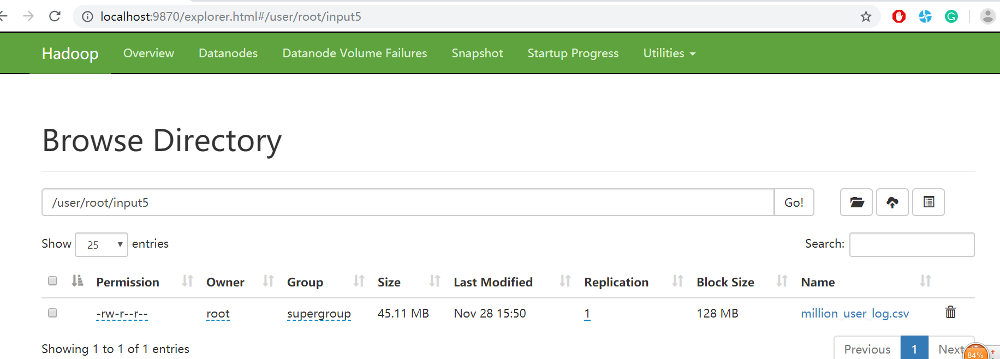

2. 将代码打包后执行**第一个MapReduce程序**

   `elevencount.itemBeanhadoop jar eleven.jar elevenbuy.countDriver input5 output7_1`

   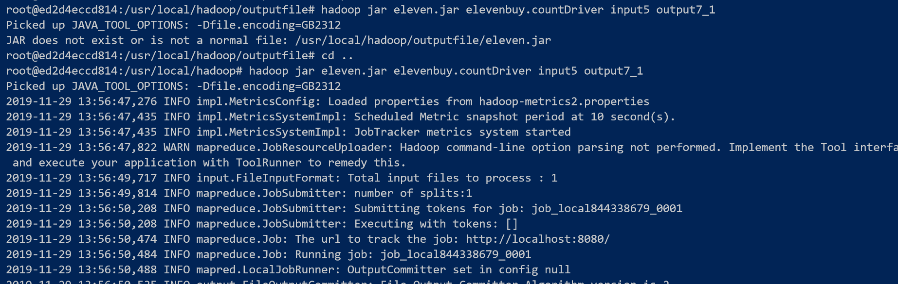

   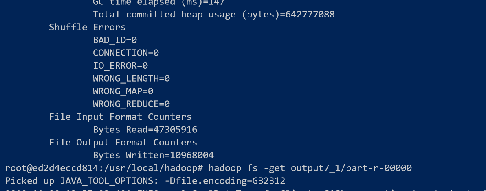

3. 将第一个MapReduce的输出作为第二个MapReduce程序的输入

   `hadoop fs -get output7_1/part-r-00000`

   `hadoop fs -mkdir input8`

   `hadoop fs -put part-r-00000 input8`

   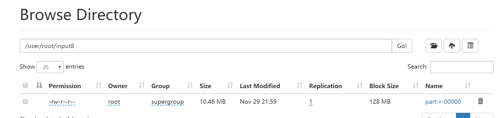

4. 执行第二个MapReduce程序

   `hadoop jar eleven.jar popularitem.countDriver input8 output8`

   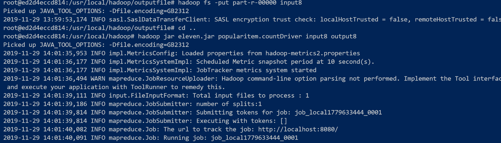

5. 第二个MapReduce程序将分省排序的结果输出，每个省独立一个输出

   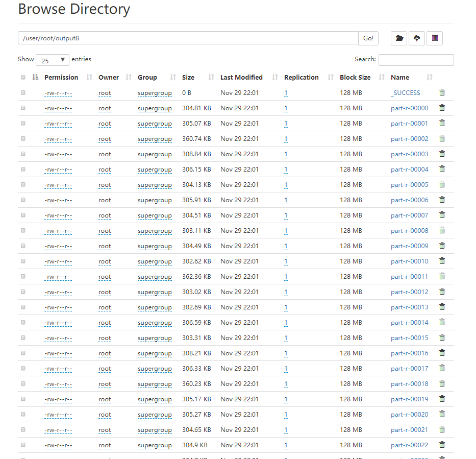

   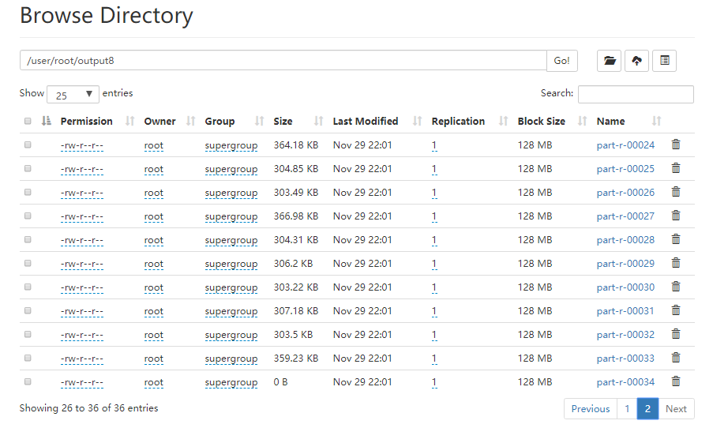

6. 把结果从hdfs拿下来

   `hadoop fs -get output8/* output_buy/`

   `docker cp ed2:/usr/local/hadoop/output_buy outputbuy/`

   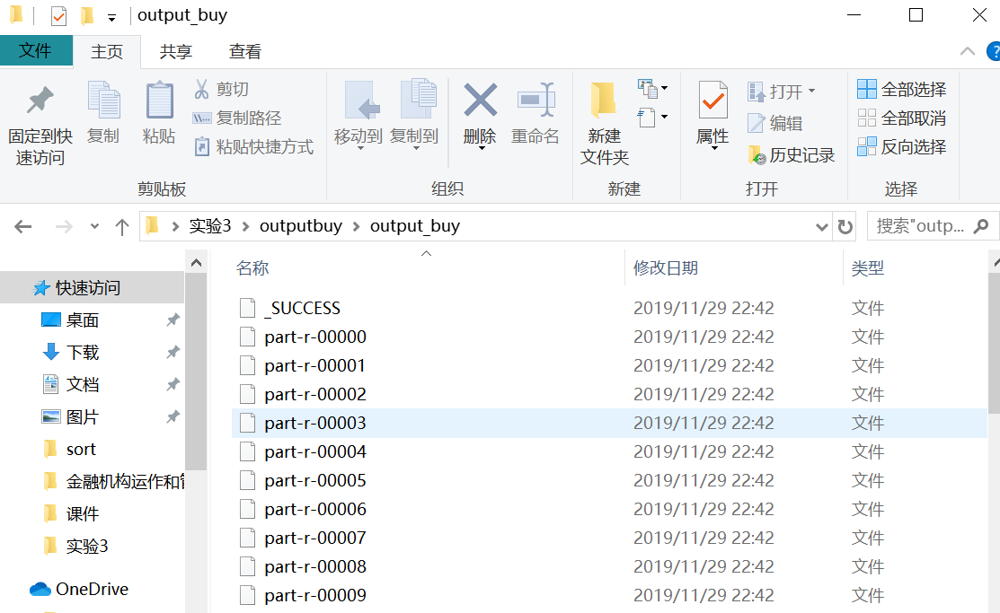

   - 其中输出文件尾号和省份的对应关系为：

   - | 尾号 | 地区   | 尾号 | 地区   | 尾号 | 地区   |
     | ---- | ------ | ---- | ------ | ---- | ------ |
     | 0    | 安徽   | 12   | 湖北   | 24   | 上海市 |
     | 1    | 澳门   | 13   | 湖南   | 25   | 四川   |
     | 2    | 北京市 | 14   | 吉林   | 26   | 台湾   |
     | 3    | 福建   | 15   | 江苏   | 27   | 天津市 |
     | 4    | 甘肃   | 16   | 江西   | 28   | 西藏   |
     | 5    | 广东   | 17   | 辽宁   | 29   | 香港   |
     | 6    | 广西   | 18   | 内蒙古 | 30   | 新疆   |
     | 7    | 贵州   | 19   | 宁夏   | 31   | 云南   |
     | 8    | 海南   | 20   | 青海   | 32   | 浙江   |
     | 9    | 河北   | 21   | 山东   | 33   | 重庆市 |
     | 10   | 河南   | 22   | 山西   | 34   | 其他   |
     | 11   | 黑龙江 | 23   | 陕西   |      |        |

7. 以福建省为例，对应输出文件part-r-00003，看一下结果：

   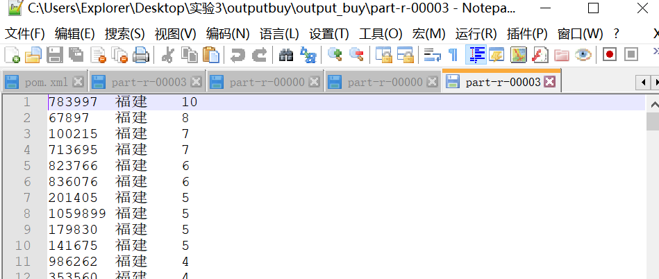

   福建省最多购买的商品ID是783997，双十一期间购买了10件

   福建省双十一前十热门购买的产品分别为：

   1、78397

   2、67896

   3、100215

   4、713695

   5、823766

   6、836076

   7、201405

   8、1059899

   9、179830

   10、141675

8. 统计双十一前十热门关注产品与统计双十一前十热门购买产品的程序运行流程一致，相关程序和输出文件都以附件形式提供

   

### 

## 阶段二实验报告：Hive

### Hive的安装

1. 先用wget方法从清华大学的镜像上下载Hive-3.1.2

   `wget https://mirrors.tuna.tsinghua.edu.cn/apache/hive/hive-3.1.2/apache-hive-3.1.2-bin.tar.gz`

   `ls`

   

2. 解压安装

   `tar -zxvf apache-hive-3.1.2-bin.tar.gz -C /usr/local/`

3. 配置hive-env.sh

   hive的conf/下本来是没有hive-env.sh的，需要将hive-env.sh.template这样的模板文件复制或者更名为hive-env.sh

   然后在hive-env.sh增加下面两行（说明hadoop的位置，和hive配置文件的位置）：

   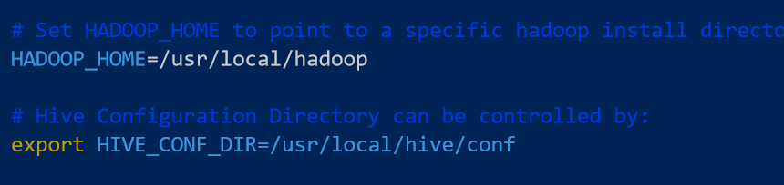

4. 安装所遇到的坑和解决方案

   - Hive中lib/guava.jar文件版本与hadoop的guava.jar文件版本不一致，导致hive shell启动失败

     解决方案：比较两个guava.jar文件哪个版本更新，并统一替换为版本更新的guava.jar。

   - shell打开后，无法执行show databases;

     解决方案：如果是用的是hive自带的内存数据库derby,应该先初始化，进入hive目录，里面有一个metestore文件夹（是之前启动hive的derby时自动生成的，这里需要将metastore_db 目录重命名为 metastore_db.tmp，然后再初始化）。

     解决步骤（在hive目录下）：
     1.> mv metastore_db metastore_db.tmp
     2.> bin/schematool -initSchema -dbType derby

     参考资料： https://ask.csdn.net/questions/679379 

### 创建表格，导入数据

- 创建表格

`create table eleven(user_id int,item_id int,cat_id int,merchant_id int,brand_id int,month int,day int,action int, age_range int,gender string,province string) row format delimited fields terminated by ','`

注意：一定要指定分隔符

- 导入表格

  `load data local inpath '/usr/local/hadoop/input/million_user_log.csv' into table student`

- 看一看导入的表格

  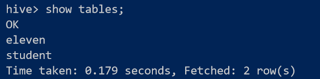

### 查询双11那天有多少人购买了商品

`select count(*) from eleven where action=2;`

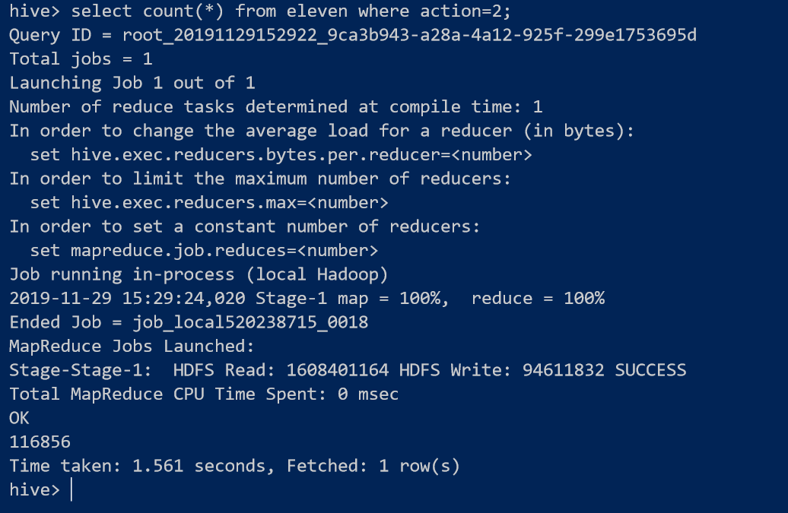

所以，精简数据集中有116856人次购买商品

**但是这计算出的只是购买商品的人次，我们再计算有多少人购买了商品**：

`select count(*) from eleven where action=2 group by user_id;`

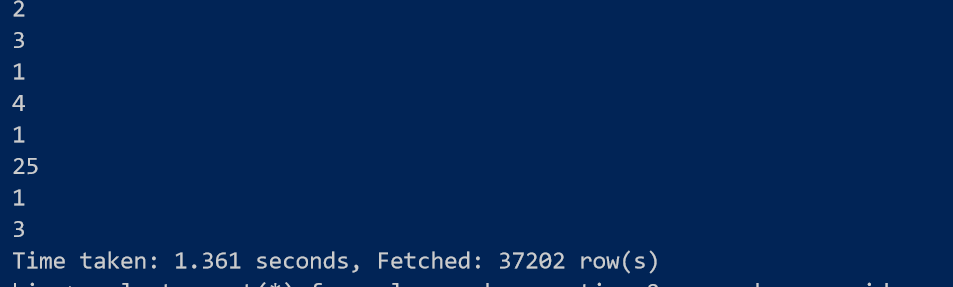

有37202条记录，说明有37202人购买了商品

### 查询双11那天男女买家购买商品的比例

因为数据中同一个user_id可能在不同的记录中有不同的性别，所以这里先从记录出发，查询标注男女买家的记录购买商品的比例，然后再基于user_id的不同计算男女买家购买商品的比例：

`select count(*) from eleven where gender='0';`

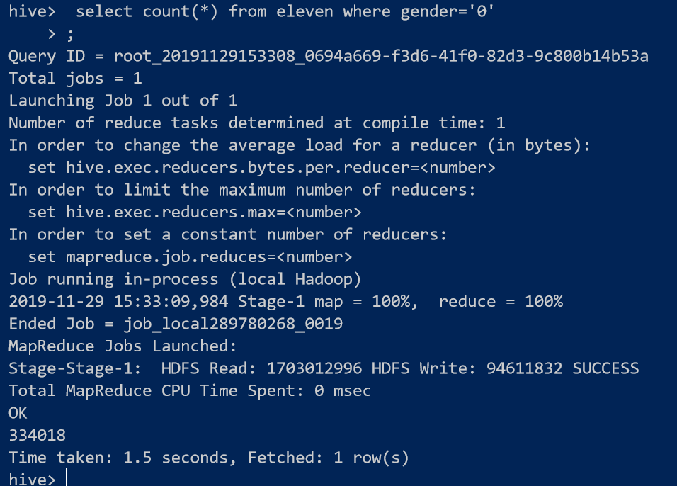

`select count(*) from eleven where gender='0' and action=2;`

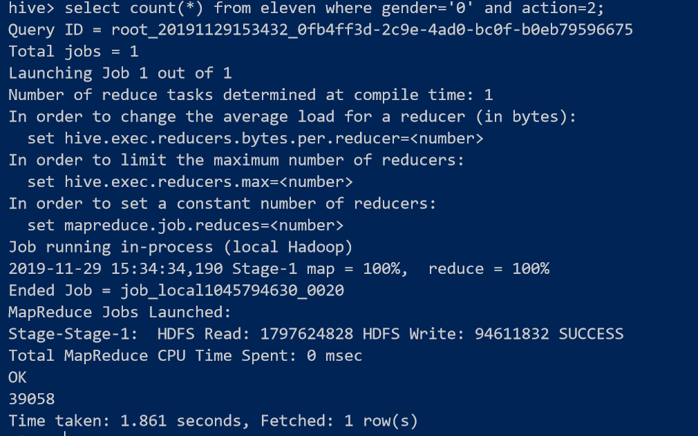

所以，在所有标注为女性的记录中，有39058/334018=11.69%购买了商品

`select count(*) from eleven where gender='1';`

`select count(*) from eleven where gender='1' and action=2;`

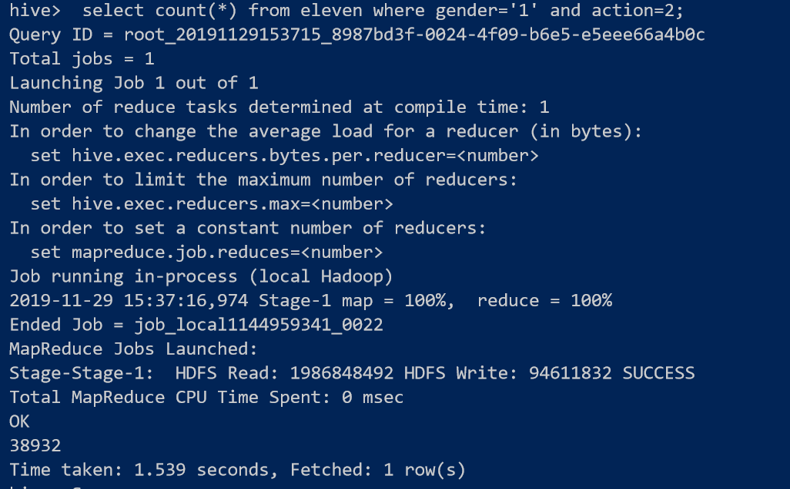

所以，在所有标注为男性的记录中，有38932/333320=11.68%购买了商品

**以上是从记录出发，下面我们从user_id出发考虑女性和男性购买商品的比例：**

先计算有多少个标注为女性的user_id:

`select count(*) from eleven where gender='0' group by user_id;`

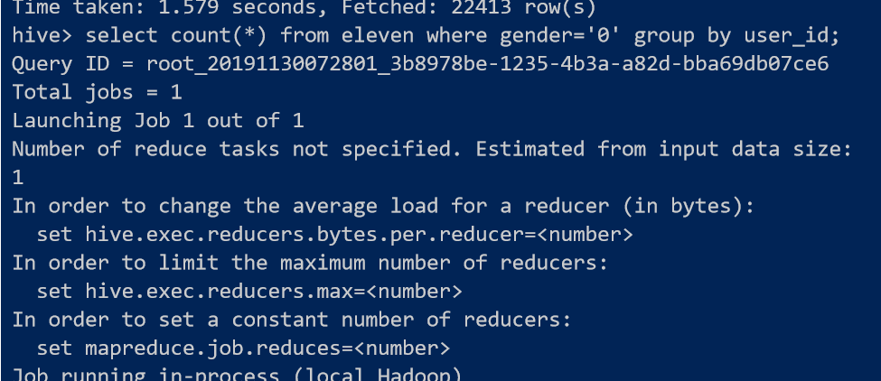

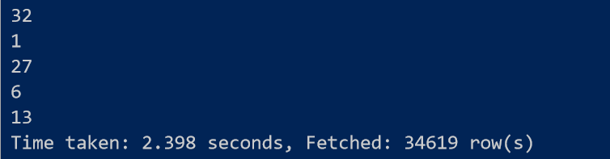

有34619个标注为女性的user_id

再看这些user_id有购买商品的人数：

` select count(*) from eleven where gender='0' and action=2 group 
by user_id;`

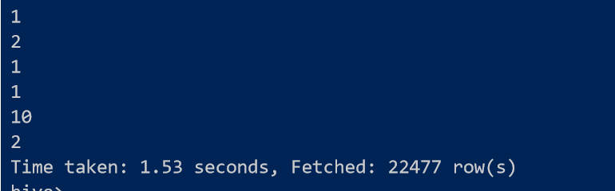

**所以，22477/34619=64.93%的女性购买了商品；**

同理，先计算有多少个标注为男性的user_id：

`select count(*) from eleven where gender='1' group by user_id;`

有34556个，再算这些user_id中有多少购买了商品：

` select count(*) from eleven where gender='1' and action=2 group 
by user_id;`

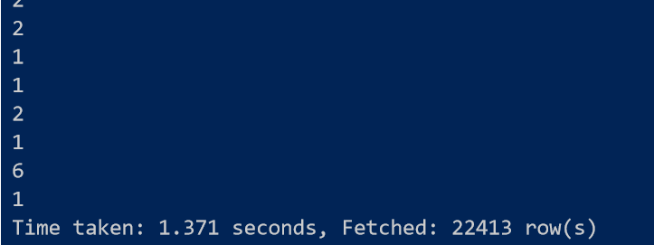

**所以，22413/34556=64.86%的男性购买了商品。**

**综上，22477/34619=64.93%的女性购买了商品，22413/34556=64.86%的男性购买了商品。**

### 查询双11那天浏览次数前十的品牌

`select brand_id,count(*) from eleven group by brand_id order by -1*count(*) limit 10;`

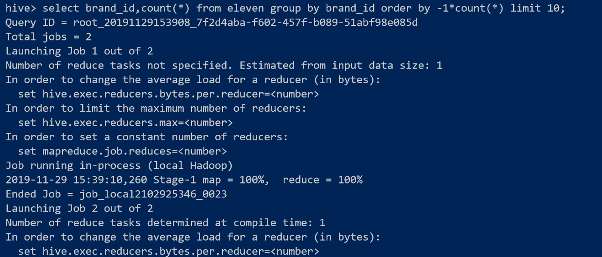

浏览次数前十的品牌为：

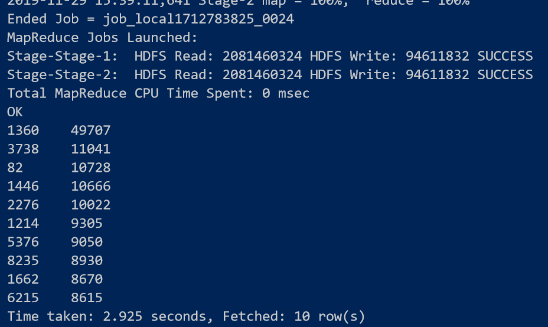

（左边是品牌id,右边是浏览次数）