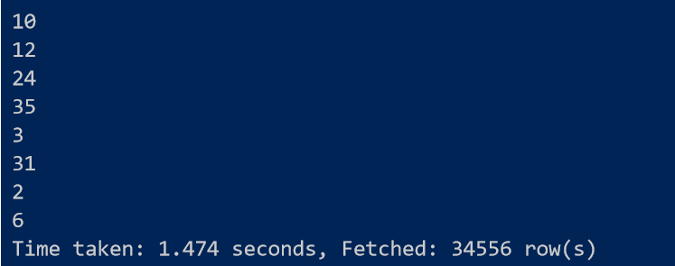
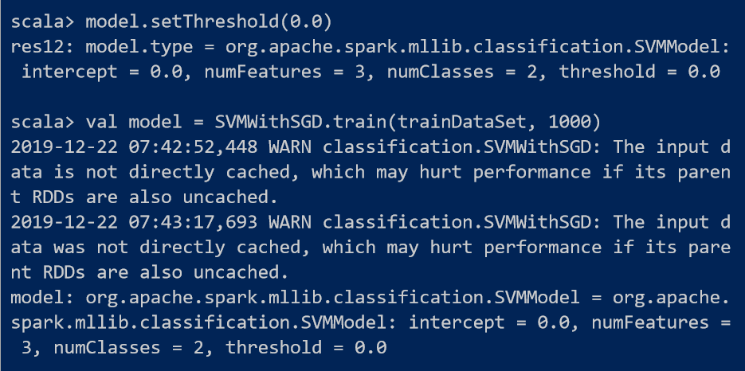

# 金融大数据处理技术实验三实验报告

171098547 郭泰麟 计算机与金融工程实验班

## 阶段一：基于$MapReduce$找出双十一关注最多和购买最多的商品

### 阶段一任务（$MapReduce$）

- 精简数据集：淘宝双十一用户购物数据集（100万条），见附件 million_user_log.csv.zip

- 基于精简数据集完成$MapReduce$作业：
  - 统计各省的双十一前十热门关注产品（“点击+添加购物车+购买+关注”总量最多前10的产品）
  - 统计各省的双十一前十热门销售产品（购买最多前10的产品）

### 编程思路

1. 首先考虑如何用$MapReduce$统计各省的双十一前十热门关注产品?
2. 编程方式可以分为两步走：
   1. 第一步：写一个$MapReduce$程序实现商品关注的分省求和
   2. 第二步：将第一步分省求和的结果作为输入，再写一个$MapReduce$程序按省分类从大到小排序输出，其中每个输出文件前10个商品就是对应省份的双十一前十热门关注产品

- 统计双十一前十热门销售产品与统计双十一前十热门关注产品思路一致，实践中只有一行代码不同

### 技术使用

- 因为商品的参数不止一种，所以自定义一个结构类型itemBean.class
- 为了实现从大到小排序，自定义一个结构类型longBean.class，通过改变其中的compareTo()函数改变排序的方向
- 为了实现按省份分区，自己实现ProvincePartitioner.class，使最终输出结果分省份输出，每一个输出代表一个省份的结果

### 代码

见文件夹

### 程序执行（以统计双十一前十热门销售产品为例）

1. 将精简数据集传至hdfs上

   ```bash
   hadoop fs -put million_user_log.csv input5
   ```

   

2. 将代码打包后执行**第一个$MapReduce$程序**

   ```bash
   elevencount.itemBeanhadoop jar eleven.jar elevenbuy.countDriver input5 output7_1
   ```

   

   

3. 将第一个$MapReduce$的输出作为第二个$MapReduce$程序的输入

   ```bash
   hadoop fs -get output7_1/part-r-00000
   
   hadoop fs -mkdir input8
   
   hadoop fs -put part-r-00000 input8
   ```

   

4. 执行第二个$MapReduce$程序

   ```powershell
   hadoop jar eleven.jar popularitem.countDriver input8 output8
   ```

   

5. 第二个$MapReduce$程序将分省排序的结果输出，每个省独立一个输出

   

   

6. 把结果从hdfs拿下来

   ```powershell
   hadoop fs -get output8/* output_buy/
   
   docker cp ed2:/usr/local/hadoop/output_buy outputbuy/
   ```

   

   - 其中输出文件尾号和省份的对应关系为：

   - | 尾号 | 地区   | 尾号 | 地区   | 尾号 | 地区   |
     | ---- | ------ | ---- | ------ | ---- | ------ |
     | 0    | 安徽   | 12   | 湖北   | 24   | 上海市 |
     | 1    | 澳门   | 13   | 湖南   | 25   | 四川   |
     | 2    | 北京市 | 14   | 吉林   | 26   | 台湾   |
     | 3    | 福建   | 15   | 江苏   | 27   | 天津市 |
     | 4    | 甘肃   | 16   | 江西   | 28   | 西藏   |
     | 5    | 广东   | 17   | 辽宁   | 29   | 香港   |
     | 6    | 广西   | 18   | 内蒙古 | 30   | 新疆   |
     | 7    | 贵州   | 19   | 宁夏   | 31   | 云南   |
     | 8    | 海南   | 20   | 青海   | 32   | 浙江   |
     | 9    | 河北   | 21   | 山东   | 33   | 重庆市 |
     | 10   | 河南   | 22   | 山西   | 34   | 其他   |
     | 11   | 黑龙江 | 23   | 陕西   |      |        |

7. 以福建省为例，对应输出文件part-r-00003，看一下结果：

   

   福建省最多购买的商品ID是783997，双十一期间购买了10件

   福建省双十一前十热门购买的产品分别为：

   1、78397

   2、67896

   3、100215（并列第三）

   4、713695（并列第三）

   5、823766（并列第五）

   6、836076（并列第五）

   7、201405（并列第六）

   8、1059899（并列第六）

   9、179830（并列第六）

   10、141675（并列第六）

   （注意到，并列产品的顺序可调换）

8. 统计双十一前十热门关注产品与统计双十一前十热门购买产品的程序运行流程一致，相关程序和输出文件都以附件形式提供

   

## 阶段二实验报告：$Hive$

### $Hive$的安装

1. 先用$wget$方法从清华大学的镜像上下载Hive-3.1.2

   ```bash
   wget https://mirrors.tuna.tsinghua.edu.cn/apache/hive/hive-3.1.2/apache-hive-3.1.2-bin.tar.gz
   ls
   ```

   

2. 解压安装

   ```powershell
   tar -zxvf apache-hive-3.1.2-bin.tar.gz -C /usr/local/
   ```

   

3. 配置hive-env.sh

   hive的conf/下本来是没有hive-env.sh的，需要将hive-env.sh.template这样的模板文件复制或者更名为hive-env.sh

   然后在hive-env.sh增加下面两行（说明hadoop的位置，和hive配置文件的位置）：

   

4. 安装所遇到的坑和解决方案

   - Hive中lib/guava.jar文件版本与hadoop的guava.jar文件版本不一致，导致hive shell启动失败

     解决方案：比较两个guava.jar文件哪个版本更新，并统一替换为版本更新的guava.jar。

   - shell打开后，无法执行show databases;

     解决方案：如果是用的是hive自带的内存数据库derby,应该先初始化，进入hive目录，里面有一个metestore文件夹（是之前启动hive的derby时自动生成的，这里需要将metastore_db 目录重命名为 metastore_db.tmp，然后再初始化）。

     解决步骤（在hive目录下）：
     1.> mv metastore_db metastore_db.tmp
     2.> bin/schematool -initSchema -dbType derby

     参考资料： https://ask.csdn.net/questions/679379 

### 创建表格，导入数据

- 创建表格

```sql
create table eleven(user_id int,item_id int,cat_id int,merchant_id int,brand_id int,month int,day int,action int, age_range int,gender string,province string) row format delimited fields terminated by ','
```

注意：一定要指定分隔符

- 导入表格

  ```sql
  load data local inpath '/usr/local/hadoop/input/million_user_log.csv' into table student
  ```

  

- 看一看导入的表格

  


### 查询双11那天有多少人购买了商品

```sql
select count(*) from eleven where action=2;
```


所以，精简数据集中有116856人次购买商品

**但是这计算出的只是购买商品的人次，我们再计算有多少人购买了商品**：

```sql
select count(*) from eleven where action=2 group by user_id;
```


有37202条记录，说明有37202人购买了商品

### 查询双11那天男女买家购买商品的比例

因为数据中同一个user_id可能在不同的记录中有不同的性别，所以这里先从记录出发，查询标注男女买家的记录购买商品的比例，然后再基于user_id的不同计算男女买家购买商品的比例：

```sql
select count(*) from eleven where gender='0';
```


```sql
select count(*) from eleven where gender='0' and action=2;
```


所以，在所有**标注为女性的记录**中，有39058/334018=11.69%的记录购买了商品

```sql
select count(*) from eleven where gender='1';
```


```sql
select count(*) from eleven where gender='1' and action=2;
```


所以，在**所有标注为男性的记录**中，有38932/333320=11.68%的记录购买了商品

#### **以上是从记录出发，下面我们从*user_id出发*考虑女性和男性购买商品的比例：**

先计算有多少个标注为女性的user_id:

```sql
select count(*) from eleven where gender='0' group by user_id;
```


有34619个标注为女性的user_id

再看这些user_id有购买商品的人数：

```sql
select count(*) from eleven where gender='0' and action=2 group by user_id;
```


**所以，22477/34619=64.93%的女性购买了商品；**

同理，先计算有多少个标注为男性的user_id：

```sql
select count(*) from eleven where gender='1' group by user_id;
```



有34556个，再算这些user_id中有多少购买了商品：

```sql
select count(*) from eleven where gender='1' and action=2 group by user_id;
```


**所以，22413/34556=64.86%的男性购买了商品。**

**综上，22477/34619=64.93%的女性购买了商品，22413/34556=64.86%的男性购买了商品。**


### 查询双11那天浏览次数前十的品牌

```sql
select brand_id,count(*) from eleven group by brand_id order by -1*count(*) limit 10;
```

`


浏览次数前十的品牌为：


（左边是品牌id,右边是浏览次数）


## 阶段三实验报告：$Spark$


1、启动$spark-shell(scala)$之前，先启动一下$hadoop$，并用$jps$看一下进程


2、启动$spark-shell$


### 用$Spark$统计各省最多关注的产品类别前十

1、读入数据

```scala
val data=sc.textFile("input5/million_user_log.csv")
```


2、将数据转换成$pair\ RDD$格式，并将同省同产品的数据累加

```scala
val focusItem=data.map(x=>((x.split(",")(1),x.split(",")(10)),1)).reduceByKey{case (x,y)=>x+y}
```


3、按省分组取前10

```scala
val tmp=focusItem.groupBy(x=>(x._1)._2)

tmp.map(group =>(group._1,group._2.toList.sortWith(_._2>_._2).take(10))).collect.foreach(println)
```


这里输出的就是各省前十关注的产品，输出的格式是这样的

（产品ID，省份），点击+添加购物车+购买+关注数

注意到省份在$docker$命令行中的输出中有一定乱码，这是因为$spark$对中文支持不够好，但这并不影响实验

### 用$Spark$统计各省最多购买的产品类别前十

1、读入数据

```scala
val data=sc.textFile("input5/million_user_log.csv")
```


2、过滤出购买的数据

```scala
val buyData=data.filter(line=>line.split(',')(7)=="2")`
```


3、合并（分省份按产品）

```scala
val focusItem=buyData.map(x=>((x.split(",")(1),x.split(",")(10)),1)).reduceByKey{case (x,y)=>x+y}
```


4、按省分组取前10

```scala
val tmp=focusItem.groupBy(x=>(x._1)._2)

tmp.map(group => (group._1,group._2.toList.sortWith(_._2>_._2).take(10))).collect.foreach(println)
```


这里输出的就是各省在双十一前十购买的产品，输出格式为：

(（产品ID,省份），购买次数）

注意到$docker$命令行中省份为乱码，这是因为$spark$对中文的支持不够好，但这并不影响实验

### 与$MapReduce$的结果比较

用$spark$做出来的结果与MapReduce做出来的结果是一致的，$spark$的优点便在与执行速度快、代码简洁，以前面在$MapReduce$阶段提到的福建双十一购买前十比较：

$Spark$的结果是这样的：


（$Spark$结果：福建双十一前十购买）

这与前文中$MapReduce$阶段做出来的福建双十一前十购买**是一致的**，**当然如果购买量相同的几个产品，哪个排在前面其实不重要，比如福建的数据有四个产品购买数为5，那么四个产品的内部排序不重要，它们的排名其实是并列的**


（$MapReduce$结果:福建双十一前十购买）

### 通过$Spark$查询双11那天浏览次数前十的品牌（与$Hive$作业对比）

1、读入数据

```scala
val data=sc.textFile("input5/million_user_log.csv")
```


2、合并（但是数据结构中包括品牌）

```scala
val focusBrand=data.map(x=>(x.split(",")(4),1)).reduceByKey{case (x,y)=>x+y}
```


3、排序取前10

```scala
focusBrand.sortBy(_._2,false).take(10).foreach(println)
```


这就是双十一浏览前十品牌

输出的结果为（品牌ID，浏览次数）

与$Hive$作业对比：


（$Hive$）

**可见$Spark$的结果和$Hive$的结果完全一致。**


## 阶段四实验报告：预测回头客

预测回头客我们依然使用$Spark$来做，但是与前面的实验不同，预测回头客需要使用到$MLlib$的包

1、首先在$Spark-shell(scala)$里导入一下相关的包：

```scala
import org.apache.spark.mllib.classification.LogisticRegressionWithLBFGS
import org.apache.spark.mllib.evaluation.BinaryClassificationMetrics
import org.apache.spark.mllib.regression.LabeledPoint
import org.apache.spark.mllib.util.MLUtils
import org.apache.spark.mllib.regression.LabeledPoint
import org.apache.spark.mllib.linalg.{Vectors,Vector}
import org.apache.spark.mllib.classification.{SVMModel, SVMWithSGD}
import org.apache.spark.mllib.classification.NaiveBayes
```


2、读入训练集和测试集

```scala
val trainData = sc.textFile("spark/train_after.csv")
val testData = sc.textFile("spark/test_after.csv")
```


3、然后用$LabeledPoint$做一下标记，属性（是否回头客，1或0）标记为$Double$类型，特征值标记为$Double$的$Vectors$向量

```scala
val train= trainData.map{x =>
  val tmp = x.split(',')
  LabeledPoint(tmp(4).toDouble,Vectors.dense(tmp(1).toDouble,tmp
(2).toDouble,tmp(3).toDouble))
}


val test = testData.map{x =>
  val tmp = x.split(',')
 LabeledPoint(tmp(4).toDouble,Vectors.dense(tmp(1).toDouble,tmp(2).toDouble,tmp(3).toDouble))
}
```


### 使用朴素贝叶斯模型预测

4、用朴素贝叶斯模型进行是否是回头客的预测

```scala
val nbTrained = NaiveBayes.train(train)
```


准备一下测试集

```scala
val testvec = testData.map{x =>
  val tmp = x.split(',')
  Vectors.dense(tmp(1).toDouble,tmp(2).toDouble,tmp(3).toDouble)
}
```


朴素贝叶斯模型预测：

```scala
val nbPredict = nbTrained.predict(testvec)
nbPredict.foreach(println)
```


打印出的数字就是预测结果了，大部分的预测结果都是0，因为大部分的用户都不是回头客。

#### 模型预测与评估

5、模型预测和评估

我们注意到，测试集里的label全都是1并不是因为它真的是1，而是因为我们假定它是1。这样的数据是无法验证模型的精度的。而训练集的label至少都是可信性。

因此，我们决定从训练集入手，将训练集的一部分（70%）作为训练集，另一部分（30%）作为测试集，划分训练集和测试集的方式是随机的：

```scala
val divData = train.randomSplit(Array(0.7, 0.3), seed = 13L)
val divData = train.randomSplit(Array(0.5, 0.5))
val trainDataSet = divData(0)//新划分的训练集
val testDataSet = divData(1)//新划分的测试集
```


训练模型（朴素贝叶斯）并预测：

```scala
val nbTrained = NaiveBayes.train(trainDataSet)
val nbPredict = nbTrained.predict(testDataSet.map(_.features))
```


看一下预测的结果：

```scala
nbPredict.foreach(println)
```


预测的结果也大多是0，即预测不是回头客，现实中大部分的顾客也不是回头客。

接下来我们要预测准确率，即预测正确的项目，占所有项目的比率：

```scala
val predictionAndLabel = nbPredict.zip(testDataSet.map(_.label))
// 预测正确的项目，占所有项目的比率
val accuracy = 100.0 * predictionAndLabel.filter(x => x._1 == x._2).count() / testDataSet.count()
println("Accuracy: "+accuracy)
```


准确率为94.29%，即94.29%的预测是正确的。

### 使用支持向量机模型进行预测

下面我们使用另一种机器学习算法：支持向量机，来做是否回头客的预测

因为在上面我们已经导入了机器相关的$MLlib$的包，也处理了训练集和测试集，所以我们直接训练$SVM$模型：

```scala
val model = SVMWithSGD.train(trainDataSet, 1000)
```

(迭代次数设为1000次)



进行预测：

```sca
val scoreAndLabels = testDataSet.map{point =>
  val score = model.predict(point.features)
  (score,point.label)
}
scoreAndLabels.foreach(println)
model.setThreshold(0.0)
scoreAndLabels.foreach(println)
```


#### 评估模型准确性

接下来评估一下模型的准确率：

```scala
val accuracy = 100.0 * scoreAndLabels.filter(x => x._1 == x._2).count() / testDataSet.count()
println("Accuracy: "+accuracy)
```


准确率为94.67%，即94.67%的预测与实际情况相符，略好于朴素贝叶斯模型。